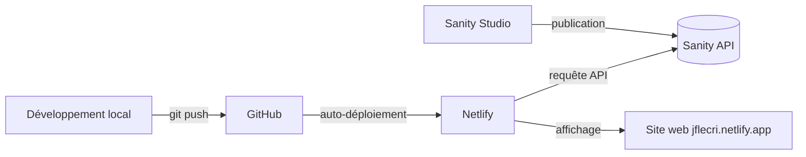

## RÉCAPITULATIF COMPLET DU PROJET "JEF LE CRI"

---

## 1. STRUCTURE DU PROJET

```
📁 Desktop/templates/
│
├── index.html                    ← Page principale du site
├── style.css                     ← Style global
│
├── 📁 css/                        ← 8 fichiers CSS modulaires
│   ├── nav.css                    ← Navigation
│   ├── hero.css                    ← Section d'accueil
│   ├── content.css                  ← Styles généraux
│   ├── player.css                   ← Lecteur AmplitudeJS
│   ├── date.css                     ← Style des dates
│   ├── mobilefirst.css               ← Responsive
│   ├── newsletters.css               ← Style newsletter
│   ├── bio.css                       ← Section biographie
│   └── footer.css                    ← Pied de page
│
├── 📁 js/                         ← Scripts JavaScript
│   ├── player.js                    ← Lecteur audio AmplitudeJS
│   ├── newsletter-brevo.js           ← Newsletter Brevo (ex-SendinBlue)
│   ├── menu.js                       ← Menu burger mobile
│   ├── sanity-client.js               ← Connexion à Sanity (NOUVEAU)
│   └── render-concerts.js             ← Affichage concerts depuis Sanity (NOUVEAU)
│
├── 📁 img/                        ← Images du site
│
├── 📁 music/                      ← Fichiers audio
│
└── 📁 jef-le-cri/                 ← Sanity Studio (CMS)
    ├── sanity.config.js
    ├── sanity.cli.js
    ├── package.json
    ├── schemaTypes/
    │   └── index.js                ← Schémas Sanity
    └── schemas/
        └── concert.js              ← Schéma "concert" personnalisé
```

---

## 2. FONCTIONNALITÉS DU SITE

### ✓ Navigation
- Menu responsive avec burger pour mobile
- Navigation fluide avec ancres

### ✓ Lecteur Audio (AmplitudeJS)
- Playlist de morceaux
- Contrôles play/pause/next/prev
- Barre de progression

### ✓ Newsletter (Brevo)
- Formulaire d'inscription stylisé
- Messages de succès/erreur
- Double opt-in configuré

### ✓ Concerts dynamiques (NOUVEAU)
- Connexion à Sanity
- Affichage automatique des concerts publiés
- Images, dates, lieux, billetterie

### ✓ Bio et réseaux sociaux
- Section biographie
- Livers Instagram, SoundCloud, Email

---

## 3. SANITY (CMS)

### Configuration
- **Project ID**: `m27cjm4v`
- **Dataset**: `production`
- **API Version**: `2023-05-03`

### Schéma Concert créé
```javascript
// Dans jef-le-cri/schemas/concert.js
{
  name: 'concert',
  type: 'document',
  fields: [
    {name: 'date', type: 'datetime'},
    {name: 'venue', type: 'string'},
    {name: 'city', type: 'string'},
    {name: 'description', type: 'text'},
    {name: 'ticketUrl', type: 'url'},
    {name: 'image', type: 'image'},
    {name: 'isPast', type: 'boolean'}
  ]
}
```

### Fonctions créées dans `sanity-client.js`
- `getUpcomingConcerts()` → Récupère les concerts à venir
- `getSanityImageUrl()` → Construit les URLs d'images
- `formatConcertDate()` → Formate les dates en français

---

## 4. PROBLÈMES RENCONTRÉS ET SOLUTIONS

### Problème 1: Git et structure de dossiers
- **Situation**: Fichiers dans différents dossiers (`templates/` et `templates/jef-le-cri/`)
- **Solution**: Travailler depuis la racine `templates/` ou ajouter avec chemins relatifs `../`

### Problème 2: CORS (Cross-Origin Resource Sharing)
- **Situation**: Erreur "No 'Access-Control-Allow-Origin' header"
- **Cause**: Netlify bloqué par Sanity
- **Solution**: Ajout de `https://jflecri.netlify.app` dans Sanity Manage (CORS origins)

### Problème 3: Concerts qui ne s'affichent pas
- **Situation**: `Concerts reçus: []` dans la console
- **Cause**: Pas de concerts publiés dans Sanity (ou brouillons)
- **Solution**: Créer et PUBLIER des concerts dans Sanity Studio

### Problème 4: Déploiement automatique
- **Situation**: Modifications locales non visibles sur Netlify
- **Solution**: 
  ```bash
  git add .
  git commit -m "message"
  git push
  ```

---

## 5. NETLIFY (HÉBERGEMENT)

### Configuration
- **Site**: `jflecri.netlify.app`
- **Lien**: Connecté au dépôt GitHub
- **Déploiement**: Automatique à chaque `git push`

### Avantages
- Déploiement automatique
- HTTPS gratuit
- Domaine personnalisable

---

## 6. FLUX DE TRAVAIL ACTUEL



### Étapes pour mettre à jour les concerts:
1. Aller sur `http://localhost:3333` (Sanity Studio)
2. Créer/modifier un concert
3. Cliquer sur **Publish**
4. Actualiser `https://jflecri.netlify.app`
5. Le concert apparaît automatiquement !

---

## 7. TECHNOLOGIES UTILISÉES

- **Frontend**: HTML5, CSS3, JavaScript vanilla
- **Framework CSS**: Bulma
- **CMS**: Sanity.io (gratuit)
- **Hébergement**: Netlify (gratuit)
- **Newsletter**: Brevo (ex-SendinBlue)
- **Lecteur audio**: AmplitudeJS
- **Versionning**: Git + GitHub

---

## 8. PROCHAINES ÉTAPES POSSIBLES

1. **Créer plus de concerts tests** dans Sanity
2. **Personnaliser l'affichage** des concerts (ordre, style)
3. **Ajouter une page "admin"** pour voir les stats
4. **Créer d'autres types de contenu** dans Sanity (albums, actualités)
5. **Optimiser le SEO** du site

---

## RÉSUMÉ

Tu as maintenant un **site complet et dynamique** :

✓ **Vitrine artistique** avec bio, musique, concerts  
✓ **CMS headless** (Sanity) pour gérer les concerts sans toucher au code  
✓ **Hébergement automatique** (Netlify)  
✓ **Newsletter** pour fidéliser ton audience  
✓ **Design responsive** (mobile/tablette/desktop)  

Le tout **GRATUITEMENT** (Sanity et Netlify ont des plans gratuits généreux) !

La prochaine fois que tu veux ajouter un concert :
1. Va sur `http://localhost:3333`
2. Crée le concert
3. Publie
4. C'est en ligne ! 🎵

Tu veux qu'on ajoute d'autres fonctionnalités ?